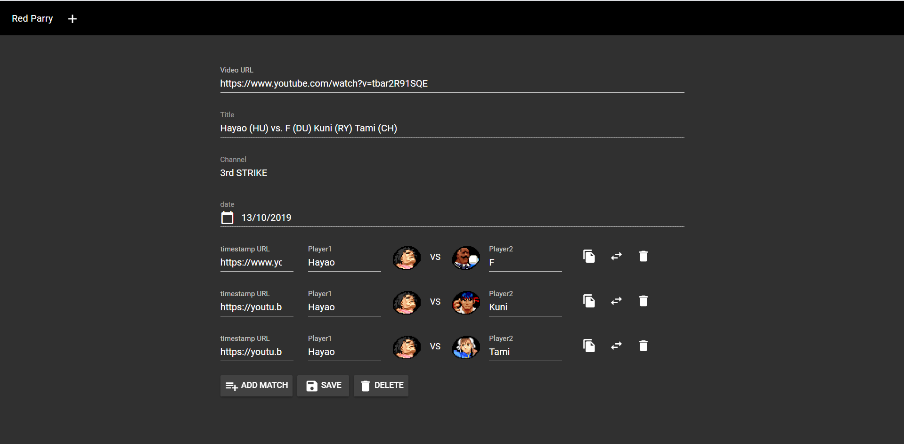

# Red Parry

This is a webapp created to mantain a database of top players/casual matches for the community of Street Fighter III: 3rd Strike.

https://redparry.herokuapp.com

## Instalation

```
git clone https://github.com/youngkaneda/red_parry
cd red_parry
npm install
npm run serve
# now go to the localhost:port link deployed by npm
```

### Observation

I used firebase and youtube google api, if you want to fork and code, you'll need create and google project and firebase project to use the respective api's key and secrets.

## Features

1. Create a record of an youtube video and register matches for it.
1. Filter the registered records and matches by:
    * Player 1 and Player 2 names.
    * Payler 1 and Player 2 characters.
    * Youtube video title.
    * Youtube video channel.
2. You can save, edit, and remove records and their matches.

## Motivation

A lot of games has a database of matches form them, Skullgirls, Melty blood... I just want to create something for the community of the game that I love.

## Screenshots




## TODO

1. Make the webapp responsive.

---

Feel free to fork and contribute.
